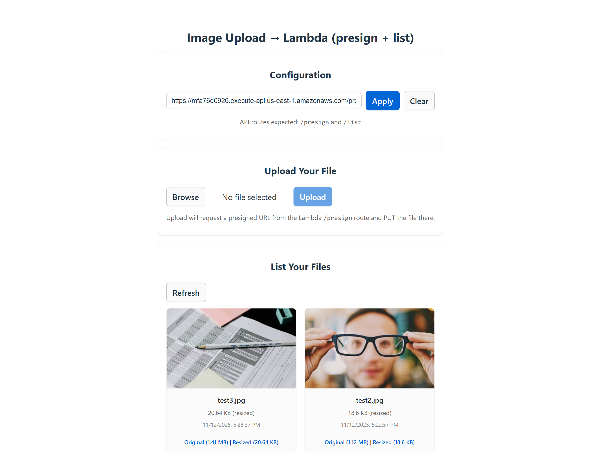
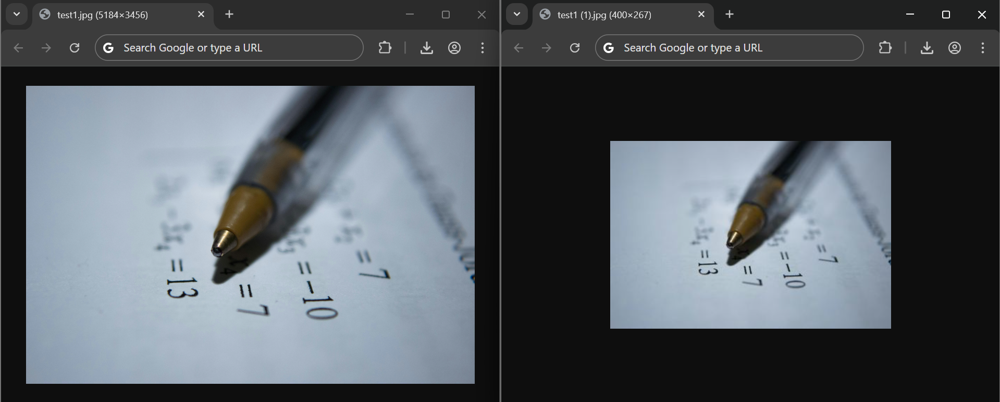

# Lambda S3 Image Resizer

A serverless image resizing application built with AWS CDK (Cloud Development Kit) using Node.js. This project implements an event-driven architecture that automatically resizes images uploaded to S3 and provides a React-based frontend for uploading and viewing images.

## 📚 Project Origin

This project is a **recreation** of the [LocalStack sample application](https://github.com/localstack-samples/sample-lambda-s3-image-resizer-hot-reload) using a completely different technology stack.

**Original Stack:**

- AWS CLI scripts for deployment
- Terraform for Infrastructure as Code
- Python Lambda functions (using boto3 and Pillow)
- Simple HTML/JavaScript frontend (jQuery, Bootstrap, Handlebars.js)
- Function URLs for Lambda invocation
- SSM Parameter Store for configuration

**This Recreation:**

- AWS CDK for Infrastructure as Code (declarative, type-safe)
- JavaScript Lambda functions (using AWS SDK v3 and Sharp)
- Modern React 19 + Vite frontend
- API Gateway REST API for centralized routing
- CloudFront + S3 for frontend deployment
- Environment variables for configuration

While maintaining the same core functionality, this recreation demonstrates how the same serverless architecture can be implemented using modern development practices and a JavaScript-first approach.

## 📸 Screenshots

### Application Interface

The React-based frontend provides an intuitive interface for uploading and managing images:



_The interface includes API configuration, file upload, and a gallery view showing both original and resized images with file size comparisons._

### Image Processing Results

The application automatically resizes uploaded images to a maximum of 400x400 pixels while preserving aspect ratio:



_Example: Original image (5184×3456) resized to (400×267), maintaining the aspect ratio._

## 🏗️ Architecture

This application uses a modern serverless architecture with the following components:

### Backend Infrastructure (AWS CDK)

- **Storage Layer**: Two S3 buckets for original and resized images with CORS configuration
- **Lambda Functions**:
  - **Presign Function**: Generates presigned POST URLs for secure direct uploads
  - **List Function**: Lists and provides signed URLs for images in both buckets
  - **Resize Function**: Automatically triggered on upload, resizes images to max 400x400px
- **API Gateway**: REST API endpoints with CORS support for frontend communication
- **Notifications**: SNS topic for error notifications via email (connected to DLQ)

### Frontend (React + Vite)

- React 19 with Vite build tool
- File upload interface
- Side-by-side display of original and resized images
- Real-time upload progress tracking
- File size comparison

## 🚀 Key Features

- **Automatic Image Processing**: Images are resized automatically when uploaded to S3
- **Aspect Ratio Preservation**: Resizes images to fit within 400x400px while maintaining proportions
- **Secure Uploads**: Uses presigned POST URLs for direct-to-S3 uploads
- **Error Handling**: Dead letter queue with SNS email notifications
- **LocalStack Support**: Built-in configuration for local development

## 🛠️ Technologies

- **AWS Services**: S3, Lambda, API Gateway, SNS, CloudFormation (via CDK)
- **Infrastructure**: AWS CDK 2.x with JavaScript
- **Local Development**: LocalStack with cdklocal for local AWS emulation
- **Image Processing**: Sharp library (0.34.4)
- **Frontend**: React 19, Vite
- **AWS SDK**: v3 (@aws-sdk/client-s3, s3-request-presigner, s3-presigned-post)
- **Runtime**: Node.js 22.x for Lambda functions

## 📋 Prerequisites

- Node.js 18.x or later
- AWS CLI configured with appropriate credentials
- AWS CDK CLI (`npm install -g aws-cdk`)
- LocalStack (optional, for local development) with `cdklocal` CLI

## 🔧 Installation

1. Clone the repository and install dependencies:

```bash
npm install
```

2. Build the Sharp layer for Lambda:

```bash
npm run layer-sharp
```

3. Set up environment variables (optional):

```bash
export AWS_STAGE=production  # or 'local' for LocalStack
export RESIZE_ERROR_EMAIL=your-email@example.com
```

## 📦 Deployment

### Deploy to AWS

```bash
cdk bootstrap  # First time only
cdk deploy
```

The deployment will output the API Gateway endpoint URL. Save this for frontend configuration.

### Deploy to LocalStack (Local Environment)

For local development using LocalStack:

```bash
export AWS_STAGE=local
cdklocal bootstrap  # First time only
cdklocal deploy
```

**Note**: Use `cdklocal` instead of `cdk` when deploying to LocalStack.

### Frontend Setup

1. Navigate to the frontend directory:

```bash
cd frontend
npm install
```

2. Configure the API endpoint in the web interface or set it programmatically

3. Start the development server:

```bash
npm run dev
```

## 📝 CDK Commands

- `cdk deploy` - Deploy the stack to your AWS account/region
- `cdk diff` - Compare deployed stack with current state
- `cdk synth` - Emit the synthesized CloudFormation template
- `cdk destroy` - Remove all resources from AWS

## 🔄 Workflow

1. User uploads an image via the React frontend
2. Frontend requests a presigned POST URL from API Gateway
3. Image is uploaded directly to S3 images bucket
4. S3 event triggers the resize Lambda function
5. Resize function downloads, processes (resizes to ≤400x400px), and uploads to resized bucket
6. User can view both original and resized versions via the list endpoint
7. Any errors during resize are sent to SNS topic for email notification

## 📁 Project Structure

```
├── bin/                    # CDK app entry point
├── lib/                    # CDK stack and construct definitions
│   └── constructs/         # Reusable CDK constructs
├── lambda/                 # Lambda function code
│   ├── presign/           # Presigned URL generator
│   ├── list/              # Image listing function
│   ├── resize/            # Image processing function
│   └── layers/            # Lambda layers (Sharp)
├── frontend/              # React web application
├── scripts/               # Build utilities
```

## ⚙️ Configuration

### Environment Variables

- `AWS_STAGE`: Controls deployment environment (`local` for LocalStack, `production` for AWS)
- `RESIZE_ERROR_EMAIL`: Email address for error notifications

### Lambda Configuration

- Resize function timeout: 30 seconds
- Resize function memory: 512MB
- Runtime: Node.js 22.x

## 🔒 Security

- Uses presigned POST URLs for secure, direct-to-S3 uploads
- CORS configuration for web access
- IAM roles with least-privilege permissions
- Dead letter queue for failed processing

## 🧹 Cleanup

To remove all resources from AWS:

```bash
cdk destroy
```

Note: S3 buckets are configured with `DESTROY` removal policy for easy cleanup during development.

## 📄 License

This project is for educational purposes.
